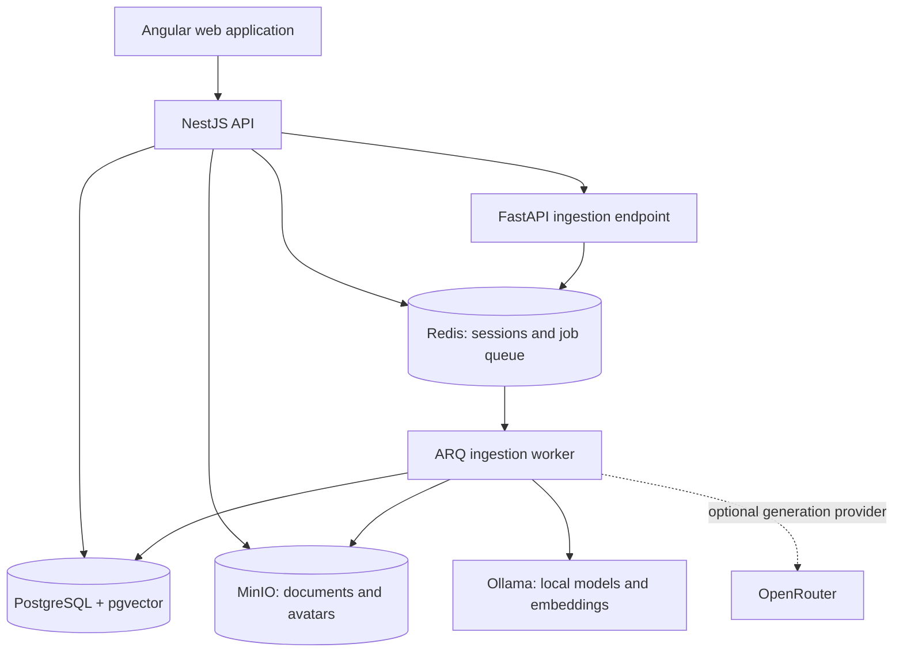

# Archie — AI-Assisted Document Management

Archie is a self-hosted document management platform being developed for **ft_transcendence**. It is designed for individuals and households who want to organize invoices, contracts, insurance policies, and tax records, ask questions about their contents, and track resulting tasks.

The project combines document storage, household access control, and AI analysis. Its goal is to reduce manual filing and make information retrievable through both structured search and a document-grounded chat interface.

**Status:** under development. This README describes the existing repository and the target architecture separately. The module allocation below comes from the project concept; it is a planning estimate, not a statement of completed evaluation requirements.

## Ports
- **Angular Frontend:** 4200
- **NestJS Backend:** 3000 -> documentation available at /docs
- **Postgres:** 5432
- **MinIO API:** 9000
- **MinIO Web Console:** 9001
- **AI-Service:** 5001

## Product scope and implementation status

| Capability | Current implementation | Planned outcome |
| --- | --- | --- |
| User management | Authentication, Redis-backed sessions, profiles, avatars, and login attempt controls | Complete multi-user experience with two-factor authentication |
| Household management | Groups, memberships, permissions, and document-to-group assignment | Households as organizations with configurable sharing and parent/child access |
| Document storage | Upload, metadata persistence, paginated listing, and streamed download through NestJS; files in MinIO | Validated uploads, previews, progress feedback, and scan capture |
| AI analysis | Queued ingestion, language detection, summaries, tag suggestions, chunking, and embeddings | Structured extraction of amounts, deadlines, counterparties, and contract terms |
| Text extraction | UTF-8 byte decoding | PDF parsing and OCR for scans and images |
| Document chat | Embeddings and vector storage provide the indexing foundation | Permission-aware retrieval-augmented generation (RAG), with source references |
| Search and tax view | Document listing currently exposes pagination | Filters by type, date, tags, and tax year |
| Tasks and notifications | Planned | Suggested payment and contract tasks, reminders, and completion tracking |
| Internationalization | Transloco integration and English, German, and Spanish translation files | Consistent localization across the application |
| Analytics and PWA | Planned | Expense/category dashboards, installation on mobile devices, and controlled offline access |
| Operations | Docker Compose, persistent volumes, and infrastructure/AI health checks | HTTPS deployment, a system status page, and automated backup and recovery |

The current extractor does **not** parse PDFs or perform OCR. Start AI ingestion experiments with UTF-8 text files; storing a file does not imply that the AI service can analyze its format.

## Architecture



| Component | Technology | Responsibility |
| --- | --- | --- |
| Frontend | Angular 22, TypeScript, Bootstrap, Transloco | Authentication, documents, profiles, users, groups, and settings |
| Application backend | NestJS 11, TypeORM, PostgreSQL driver | HTTP API, validation, sessions, authorization, metadata, and storage access |
| AI API and worker | Python 3.14+, FastAPI, ARQ, Pydantic AI | Asynchronous document analysis and indexing |
| Relational and vector database | PostgreSQL 18 with pgvector | Application records, analysis state, extracted chunks, and embeddings |
| Object storage | MinIO, S3-compatible API | Original document and avatar bytes |
| Sessions and queue | Redis | Server-side sessions and background ingestion jobs |
| Model runtime | Ollama; optional OpenRouter generation | Summarization, classification, and embeddings |
| Development orchestration | Docker Compose | Services, initialization jobs, networking, and persistent volumes |

TypeORM manages application migrations. The AI service uses asyncpg and its own SQL initialization for AI tables. Changes to shared tables must be coordinated between these two paths.

## Document processing

### Existing ingestion pipeline

1. An authenticated user uploads a file to NestJS using multipart form data.
2. The backend stores the bytes in MinIO and records metadata including the uploader, object key, filename, MIME type, byte size, and SHA-256 hash.
3. NestJS calls the AI service's `POST /ingest/{doc_id}` endpoint with an internal API key.
4. FastAPI initializes the analysis record and queues an ARQ job, returning HTTP `202`.
5. The worker loads the file, decodes its text, detects its language, and requests a structured summary and tags from the configured model.
6. Text is split into overlapping chunks. Ollama generates embeddings, which are stored with the chunks in PostgreSQL.
7. Processing state is recorded as `PENDING`, `PROCESSING`, `FINISHED`, or `FAILED`, with error details when processing fails.

Tags have two facets: `domain` describes a subject area such as insurance or housing, and `doctype` describes a document form such as invoice or contract. The analyzer can reuse existing tags or persist proposals with confidence values.

The current vector schema expects **1,024-dimensional embeddings** and uses an HNSW cosine index. Changing the embedding model requires checking dimensional compatibility and planning re-indexing. Analysis input is truncated according to the configured provider limit, so a summary may omit information from a long document.

### Planned question-answering pipeline

For a question such as “What are the conditions of my legal expenses insurance?”, the intended RAG flow is:

1. Resolve the authenticated user's permitted documents from household membership and sharing rules.
2. Embed the question and retrieve relevant chunks within that permitted document set.
3. Give the model the question and retrieved evidence, treating document text as data rather than instructions.
4. Return an answer with references to the original documents and pages where available.
5. State when the retrieved evidence is insufficient to answer.

Authorization must constrain retrieval before document content reaches the model. Answers, source links, summaries, and future caches must follow the same access rules as downloads.

### Planned tasks and tax-year view

Structured extraction will turn an invoice into a suggested task such as “Pay invoice XY by July 15.” Tasks should retain their source document, extracted deadline, assigned user, and completion status. Users must be able to review and correct AI suggestions.

The tax-year view will combine dates, tax relevance, tags, and search filters to collect a year's records. Dedicated tax-category classification, annual exports, and missing-receipt detection are optional extensions beyond this base view.

## Data and access model

| Record | Purpose |
| --- | --- |
| Users | Accounts, profiles, and language preferences |
| Groups and memberships | Existing foundation for household organization |
| Permissions and user permissions | Application and group-scoped authorization |
| Documents | Uploader, object reference, file metadata, hash, and lifecycle timestamps |
| Document groups | Association between documents and groups |
| AI documents | Analysis status, summary, detected language, and processing errors |
| AI chunks | Chunk text, document reference, and embedding |
| Tags and AI document tags | Hierarchical classification, suggestions, and confidence |

The target household policy gives parents access to shared household records and children access to their own relevant records, such as school or club documents. Sharing should be configurable rather than derived solely from an account's family label.

**Current limitation:** document list, detail, and download queries are uploader-scoped. Group assignment and permission infrastructure exist, but the complete household sharing behavior remains to be implemented. MinIO stores objects; NestJS must enforce document access. Storage credentials alone do not implement parent/child permissions.

## Local development

### Prerequisites

- Docker Engine with Docker Compose support.
- Internet access for initial image builds, dependency installation, and model downloads.
- Available RAM and disk space for the configured Ollama models and stored documents; requirements depend on model choice and document volume.
- GNU Make if using the repository's convenience targets.

### Configure and start

From the repository root, create the local configuration if it does not already exist:

```sh
cp -n env/.env.example env/.env
```

Edit `env/.env` before starting:

- Set database credentials, the seeded administrator account/password, MinIO credentials, and a strong `AI_SERVICE_API_KEY`.
- Set **`LLM_PROVIDER=ollama`** for local generation. The example currently selects `openrouter`; that mode requires a valid `OPENROUTER_API_KEY` and sends analysis content to the external provider.
- Review generation and embedding model names. Embeddings currently use Ollama even when generation uses OpenRouter.
- Leave `LANGFUSE_ENABLED=false` unless an independently configured Langfuse instance is available. Langfuse is not included in this Compose stack.

Start the stack with one command after configuration:

```sh
docker compose up --build -d
```

Compose initializes PostgreSQL, MinIO buckets (`documents` and `avatars`), an application storage user, and Ollama models. The NestJS container runs migrations before starting; the AI container initializes its SQL tables. The first startup can take longer because the Ollama initializer downloads all three configured models, including the vision model, even when generation uses OpenRouter.

Check startup and processing logs:

```sh
docker compose ps
docker compose logs -f nest-server ai-service ai-service-worker
```

### Development endpoints

| Service | Local address |
| --- | --- |
| Angular application | http://localhost:4200 |
| NestJS API | http://localhost:3000 |
| NestJS Swagger documentation | http://localhost:3000/api |
| AI service health | http://localhost:5001/health |
| MinIO API | http://localhost:9000 |
| MinIO console | http://localhost:9001 |
| Adminer | http://localhost:8080 |
| Ollama | http://localhost:11434 |
| PostgreSQL | `localhost:5432` |

Redis is available inside the Compose network and does not publish a host port. The current configuration uses HTTP and development servers; it is not the finished HTTPS evaluation deployment.

### Useful commands

```sh
# Stop services while retaining persistent volumes
docker compose down

# Backend unit tests
docker compose exec nest-server pnpm test --runInBand

# Frontend tests
docker compose exec frontend pnpm test --watch=false

# Compile both applications
docker compose exec nest-server pnpm run build
docker compose exec frontend pnpm run build

# Backend end-to-end tests with separate test infrastructure
make test
```

`make test` uses `docker-compose.test.yml` and `env/.env.test`; it does not exercise the complete AI pipeline. `make fclean` removes application volumes, including stored data, and should only be used for an intentional reset.

## API surface

The running NestJS Swagger UI at `/api` describes request and response DTOs. Selected document operations are:

| Method | Route | Purpose |
| --- | --- | --- |
| `POST` | `/documents/upload` | Upload a multipart `file` |
| `GET` | `/documents` | List the current user's documents with `page` and `limit` |
| `GET` | `/documents/:id` | Read document metadata |
| `GET` | `/documents/:id/download` | Stream the original document |
| `POST` | `/documents/:id/group` | Assign a document to a group |

These routes require a session. The separate AI ingestion endpoint uses the `X-API-KEY` header and is intended for backend-to-service communication. Use streamed downloads; the existing pre-signed URL endpoint is marked “Don't use it” in the controller.

## Self-hosting and operational roadmap

The intended deployment is a home server or another standard Docker host. Before evaluation or deployment beyond local development, the planned work includes:

- Add an HTTPS reverse proxy and certificate configuration, using a trusted certificate or an evaluation certificate as appropriate. Align frontend API URLs, CORS, session cookies, and service transport with that deployment.
- Keep database, object storage administration, model runtime, and internal AI endpoints off public interfaces; review the development port mappings.
- Complete household authorization across document access, retrieval, tasks, and analytics.
- Add file type and size validation, PDF extraction, OCR, and reliable retry/reconciliation for failed ingestion.
- Implement backups covering PostgreSQL metadata and MinIO originals together, with retention and tested restoration. Docker volumes provide persistence, not backups.
- Expand health checks into a status view and verify recovery after service failures.
- Define explicit offline document caching, logout cleanup, and cache revocation behavior for the PWA.

The local Ollama path supports processing on the host. External generation and optional tracing change where document content can be sent and should be configured deliberately.

## ft_transcendence module plan

The supplied project concept allocates **22 points**, against its stated minimum of **14**. Module eligibility and completion must be checked against the applicable subject during evaluation.

| Module | Type | Points | Project application |
| --- | --- | ---: | --- |
| RAG system | Major | 2 | Questions over authorized uploaded documents |
| LLM system interface | Major | 2 | Extraction, summaries, and suggested tasks |
| Organization system | Major | 2 | Households as organizations |
| Advanced permissions | Major | 2 | Parent/child roles and configurable sharing |
| Standard user management | Major | 2 | Profiles, avatars, login, and logout |
| Frontend and backend frameworks | Major | 2 | Angular and NestJS |
| File upload system | Minor | 1 | Validated scan/upload workflow with preview and progress |
| Notification system | Minor | 1 | Payment and deadline reminders |
| Advanced search | Minor | 1 | Type, date, tag, and tax-year filters |
| Two-factor authentication | Minor | 1 | Additional account protection |
| ORM | Minor | 1 | TypeORM persistence |
| Progressive Web App | Minor | 1 | Mobile installation and offline access |
| Internationalization: 3+ languages | Minor | 1 | English, German, and Spanish UI |
| Advanced analytics dashboard | Major | 2 | Expenses, categories, and payments over time |
| Health checks and backup/disaster recovery | Minor | 1 | System status and recoverable backups |
| **Total** | | **22** | |

Optional modules, excluded from the total:

| Module | Type | Points | Extension |
| --- | --- | ---: | --- |
| Dedicated tax-year analysis / module of choice | Major | 2 | Tax categories, annual export, and missing-receipt detection |
| WAF/ModSecurity and HashiCorp Vault | Major | 2 | Request filtering and secrets management |
| Custom design system | Minor | 1 | Reusable application UI components |
| Data export/import | Minor | 1 | CSV export or migration of existing document collections |

## Repository layout

```text
frontend/                 Angular application and translations
backend/nest-server/      NestJS API, TypeORM migrations, and backend tests
backend/ai-service/       FastAPI API, ARQ worker, analysis, and vector indexing
backend/postgres-init/    PostgreSQL extension initialization
env/                     Environment templates and local/test configuration
docs/                    Architecture notes, designs, and implementation plans
docker-compose.yml       Development stack
docker-compose.test.yml  Backend end-to-end test infrastructure
Makefile                 Development and test commands
```

Further repository documentation: [MinIO storage](docs/minio-storage.md), [Redis cookie sessions](docs/cookie-sessions-with-redis.md), [persistence design](docs/plan/typeorm-persistence-design.md), and [document data model](docs/plan/ERM_Document.md).
